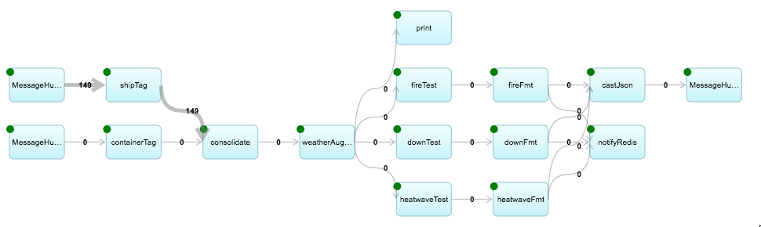

# K Container Shipment Use Case: IBM Streaming Analytics Application

This streaming application demonstrates real time event processing applied to inputs from
the ships and containers used in the K Container Shipment Use Case.  It is designed to monitor
refrigerated containers, known as reefers, stowed on ships which are traveling over blue water.
If an error condition is detected, for example a fire has started, an event is sent out to notify
the external services of the condition.

## Table Of Contents

* [What You Will Learn](#what-you-will-learn)
* [User Stories](#user-stories)
* [Application](#application)
* [Development Environment](#development-environment)
* [IBM Cloud Streaming Analytics Instance](#ibm-cloud-streaming-analytics-instance)
* [Build and Execute the Application](#build-and-execute-the-application)
* [References](#references)

## What You Will Learn
- How to implement a basic application with IBM Streaming Analytics.
- How to use business logic and machine learning models on real time data.
- The steps needed to set up and manage the IBM Streaming Analytics Service on IBM Cloud.
- How to use configure and use python for the application development. 

## User Stories 

- [ ] As a Shipping Agent, I’d like to understand the health of and manage the operations of reefer (refrigerated) containers in transit, to ensure that I am effectively protecting goods in my care, and managing cost.
- [ ] As a Shipping Agent, I need to understand when  a container isn’t operating within normal boundaries and automatically take corrective action.
- [ ] As a Shipping Agent, I’d like to understand when a container temperatures are trending towards a boundary and may need a reset.
- [ ] As a Shipping Agent, I’d like to understand when containers may have a potential failure so I can proactively take action to protect goods in transit.
- [ ] As a Shipping Agent, I’d like to understand when a container is failing so I can take corrective action.
- [ ] As a Shipping Agent, I’d like to automatically manage container settings based on any course or route deviations or rerouting events.

## Application

This section provides details for the sample application, including descriptions for the five stages
of a typical streaming application pipeline.

### Structure

The following diagram shows the flow graph for the sample application.  Data is injested on the left
side and flows through the operators to the outputs on the right.



### Ingest: Data Inputs

The application takes in a continuous stream of real time data which is used to make decisions and predict possible problems.  The data enters the streaming analytics application as a tuple which includes following data:
- Measurement timestamp.
- Ship identifier.
- Ambient temperature of the ship.
- Current ship location as a latitude / longitude pair.
- Internal temperature of each container.
- Average watt-hours of power consumption since the last measurement was taken.

### Prepare: Transform the Inputs

As input tuples arrive, a streaming application must examine the data and prepare it for
use downstream in the application.  For this example, the following steps are taken:
- Fill in missing readings with extrapolations from past data points.
- Aggregate data into widows so that the data is smoothed and missing samples are handled.
- Reject late arriving data.
- Remove and report invalid data points.

### Detect and Predict: Apply Rules and Models

This stage is responsible for applying business logic to the stream of data.  This logic can consist of 
simple bounds checks, complex rules, machine learning models, etc.  For the KC application we have 
initially implemented simple bounds checks, but will move to a more complex machine learning model in
order to illustrate a more advanced application.

The application has been designed to detect and predict the following events:
1.  Container with fresh produce that has spoiled.
2.  Container is on fire.
3.  Container refrigeration unit has failed.
4.  Container refrigeration unit power consumption is abnormal.
5.  Container temp is outside defined range.
6.  Ship arrival time estimate.

TODO: Add more complete rules and models used to do these predictions.

### Decide: Filter the Results

This stages takes the detection and predictive outputs of the prior stages and makes a decision
as to whether a finding of interest has been made.  If one has, the event is propagated to the next
stage where action is taken. 

### Act: Generate Output

TODO:


## Application Development and Deployment 

### Create the Cloud Based Environment

First log into your [IBM Cloud](http://cloud.ibm.com) account.  Then to create a Streaming Analytics instance, follow these steps:
- Select "Create Resource"
- Search the catalog for "Streaming Analytics" and select the cooresponding item.
- Select "Create"

After the instance has been provisioned, credentials can be obtained by:
- Select the new Streaming Analytics service which is shown on the cloud resource list
- In the detailed view, select "Serice credentials"
- Select "New credential" and then "Add"
- View the resulting credential and save it for later use. 

### Local Development Environment

Application development can be done on any Linux, MacOS, or Windows system with the necessary 
packages installed.  Note that specific instructions given on this page assume a Linux system.
Build is performed with a cloud based service and the application execution 
also occurs on a cloud based service.  Because this application leverages cloud services, there 
is no need to install IBM Streams on your local development system.

Prerequisit software includes Git, Docker, and the kc-streams application.
To instal Docker see the [Docker Documentation](https://docs.docker.com/) for instructions 
for your platform.  Git can be installed following instructions 
found on [GitHub.com](https://github.com/).

#### Application Download

The application can be obtained from github.com with the following command:
```bash
git clone git@github.com:ibm-cloud-architecture/refarch-kc-streams.git
```

#### Application Configuration 

Next the application requires configuration for your environment.  Edit the file found
in the git repository at:

```bash
refarch-kc-streams/python/shared/creds/credential.py 
```
and insert the credentials obtained for the Streaming Analytics services as described above.

#### Docker Image Build

A docker image configuration file is provided that will build the application 
for the cloud environment. 

```bash
cd refarch-kc-streams/python
sudo docker build -t cloudstreams -f ./Dockerfile-monitor . 
```

#### Docker run
Submit the the monitor application to the cloud server. 

```bash
cd refarch-kc-streams/python
sudo docker run -t cloudstreams
```
After the submission completes, you will be able to see the application running from your
IBM Cloud web console.

# Items that will be depricated and removed.

## IBM Cloud Streaming Analytics Instance

The following script performs the application build and submits it to the IBM Cloud Streaming Analytics service.  Once it has been successfully run, the application will be running on the cloud connected to the Event Streams bus monitoring for input events.

```bash
cd scipts
source submit_Monitor.sh
```

Run the following script to start the simulator:
```bash
cd scipts
source submit_Simulator.sh
```

### Prerequisites * Local 

The application has been written and validated with Python version 3.5, so that version is recommended
for running this application.

First, ensure that Python 3.5 is installed on your system:
```bash
python3.5 --version
```
If it is not installed, follow the process described by your OS vendor.  As an example, for CentOS:
```bash
sudo yum install python35u
```

Next you will need to set up a Python 3.5 virtual environment, as follows: 
```bash
virtualenv --python=python3.5 .venv
source .venv/bin/activate
python --version
```
Some open source packages for IBM Streams are required for this application.  
In some cases, specific versions have been selected for compatibility reasons.
To install these packages, run the following commands from your python virtual environment.

```bash
pip install streamsx
pip install --upgrade streamsx==1.11.3a0
pip install streamsx.messagehub
pip install redis 
```

## References 
 - [Developing IBM Streams Applications with Phython](http://ibmstreams.github.io/streamsx.documentation/docs/python/1.6/python-appapi-devguide/index.html)
-  [Streams Python Tutorial](https://developer.ibm.com/courses/all/streaming-analytics-basics-python-developers/)  
 - [Streamsx Documentation](https://pypi.org/search/?q=streamsx)
 - [IBM Streams Documentation](http://ibmstreams.github.io/streamsx.documentation/) 
 - [IBM Streams Python Support](https://streamsxtopology.readthedocs.io/en/latest/index.html)
 - [Ship Short Location ](https://www.navcen.uscg.gov/?pageName=AISMessagesA)
 - [Ship Long Location ](https://www.navcen.uscg.gov/?pageName=AISMessage27)

