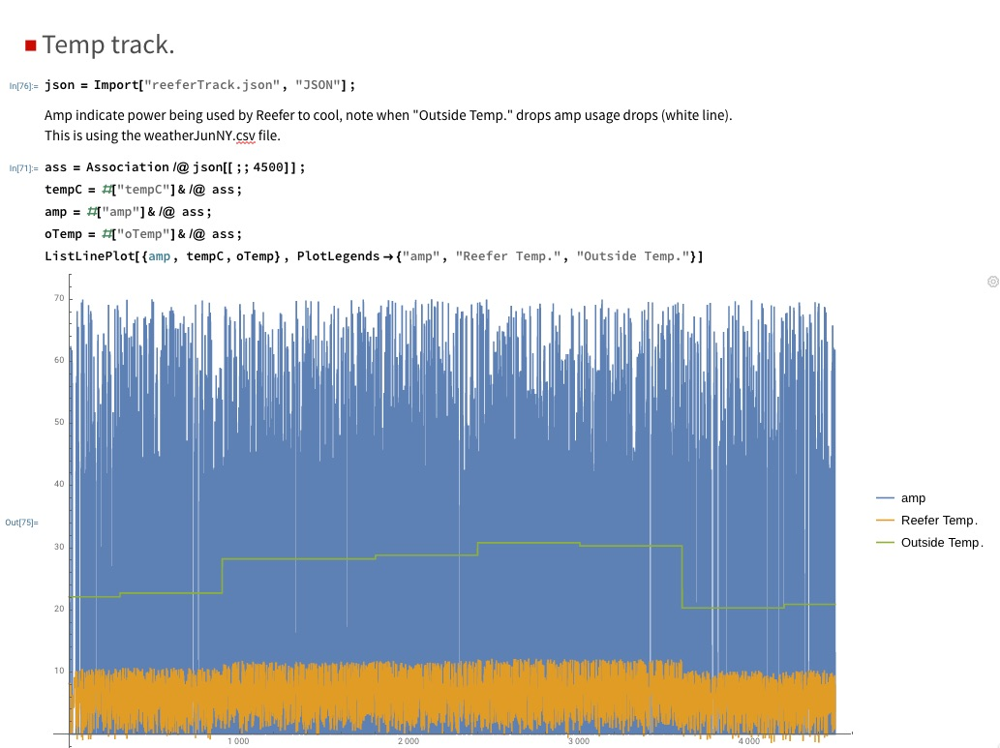

# Conatainers on Ship Simulator : Shipping Containers crossing Bluewater 

Using simpy to generate a set of reefer containers moving over bluewater. The reefers temp is generated 
independently for each container. The temp of the container is dependent on the
power(amp), insulation and outside temp. The outside temp is determined by 
a file that has hourly tempuratures. 

## Modules 
 - pip install simpy
 
 
## Learning
 - [video](https://www.youtube.com/watch?v=Bk91DoAEcjY) SimPy introduction
 - [basic](https://simpy.readthedocs.io/en/latest/contents.html) : note the realtime simulations
 - [refrigerator](https://pythonhosted.org/SimPy/Manuals/Interfacing/ParallelSimPy/SimPyPP.html) : simulator derived from here
 

 
### Files
 - containersFile.py : generate container tracks into json file.
 - jsonPlayback.py : playback json file as stream,
 - reeferTrack.json : exmample simulation output 
  

**containersFile.py** : Build the .json file that is consumed 
byt jsonPlayer.py. 

**jsonPlayback.py** default sends reeferTrack.json that has 10 reefers 
sending out updates every .2 seconds taking. At this rate it will
date 5 days to exahust the data which is how long I think I have
the ship to travel. 

This is the first simulator, Jerome has created his own so this will die. 

Updated to generate data on two MH topics: bluewaterShip, bluewaterContainer. 
This is hacky 

SimultorRun.sh invokes the jsonPlayback.py with fire data. 
 
- messageHub : jsonFile 

# Simulation Notes.
The outside temp needs to come from the weather co.
~~Currently the outside temp is determined by an hourly weather file that is 
passed to the containterFile.py. The plot below is partial plot of the 
simulation output.~~

Amps are the amount energy the unit is consuming to cool the unit. If the amp 
are up, the motor is on 'duty'.
As the temp. goes up the duty cycle goes up.  When the outside temp drops, 
the duty cycle drops as the average temp of the unit.  

TODO * more track data files in BOX.

 

